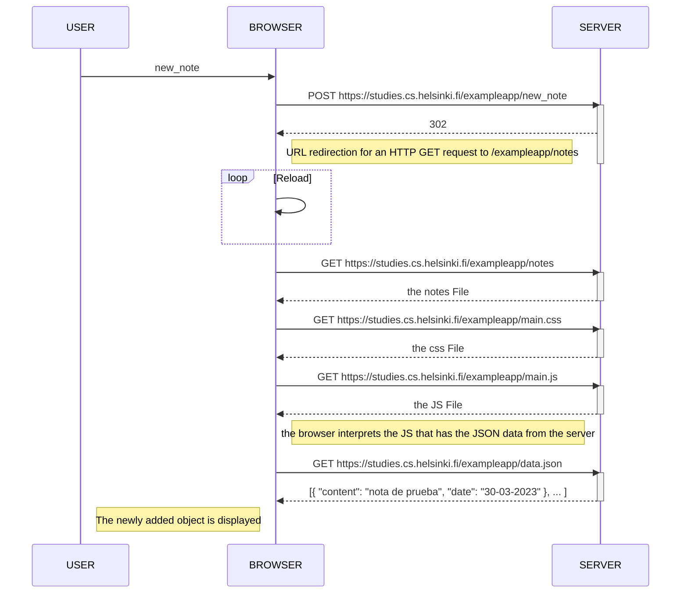

Situación: Un usuario crea nueva nota en la página escribiendo en un campo de texto y haciendo clic en el botón Enviar.

```mermaid
sequenceDiagram
    participant USER
    participant BROWSER
    participant SERVER

    USER->>BROWSER: new_note

    BROWSER->>SERVER: POST https://studies.cs.helsinki.fi/exampleapp/new_note
    activate SERVER
    SERVER-->>BROWSER:  302 
    Note right of BROWSER: URL redirection for an HTTP GET request to /exampleapp/notes
    deactivate SERVER
    loop Reload
        BROWSER->>BROWSER: 
    end

    BROWSER->>SERVER: GET https://studies.cs.helsinki.fi/exampleapp/notes
    activate SERVER
    SERVER-->>BROWSER: the notes File
    deactivate SERVER

    BROWSER->>SERVER: GET https://studies.cs.helsinki.fi/exampleapp/main.css
    activate SERVER
    SERVER-->>BROWSER: the css File
    deactivate SERVER

    BROWSER->>SERVER: GET https://studies.cs.helsinki.fi/exampleapp/main.js
    activate SERVER
    SERVER-->>BROWSER: the JS File
    deactivate SERVER

    Note right of BROWSER: the browser interprets the JS that has the JSON data from the server

    BROWSER->>SERVER: GET https://studies.cs.helsinki.fi/exampleapp/data.json
    activate SERVER
    SERVER-->>BROWSER: [{ "content": "nota de prueba", "date": "30-03-2023" }, ... ]
    deactivate SERVER

    Note right of USER: The newly added object is displayed
```
