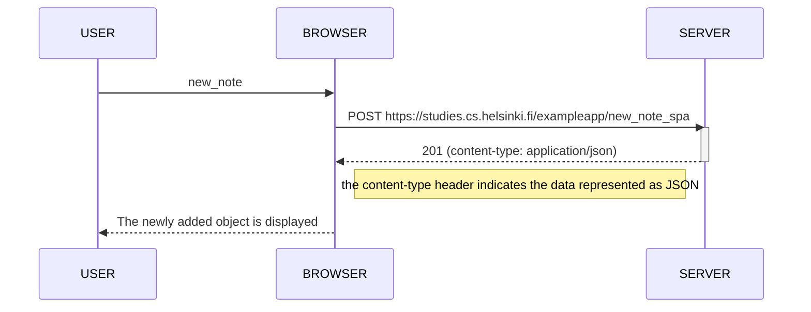

Situación: Usuario crea una nueva nota en la versión de SPA de la página de notas.

```mermaid
sequenceDiagram
    participant USER
    participant BROWSER
    participant SERVER

    USER->>BROWSER: new_note

    BROWSER->>SERVER: POST https://studies.cs.helsinki.fi/exampleapp/new_note_spa
    activate SERVER
    SERVER-->>BROWSER:  201 (content-type: application/json)
    deactivate SERVER
    
    Note left of SERVER: the content-type header indicates the data represented as JSON
    
    BROWSER-->>USER: The newly added object is displayed
```